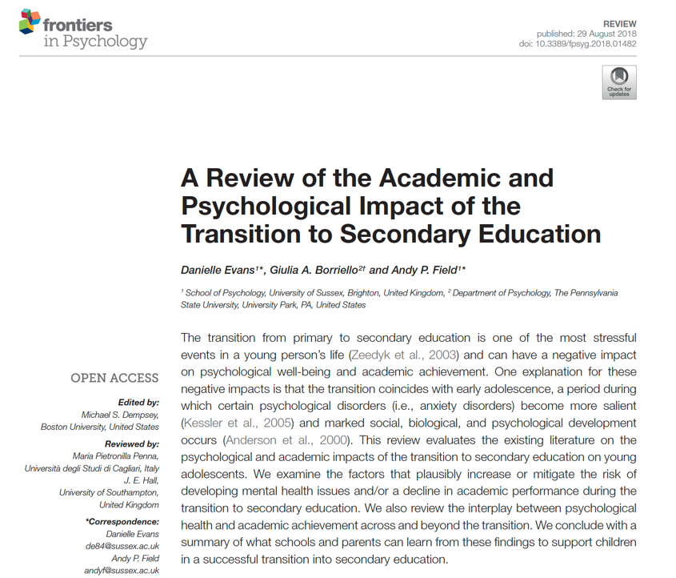
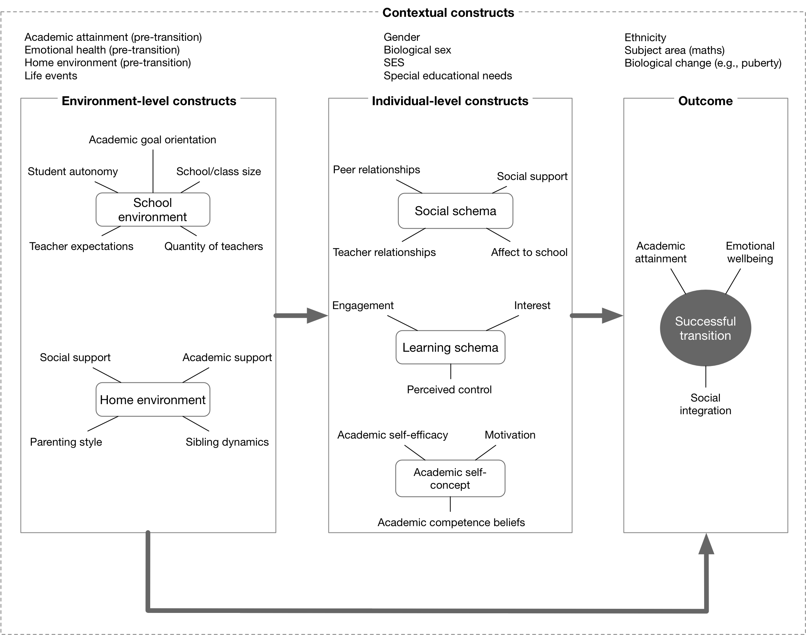
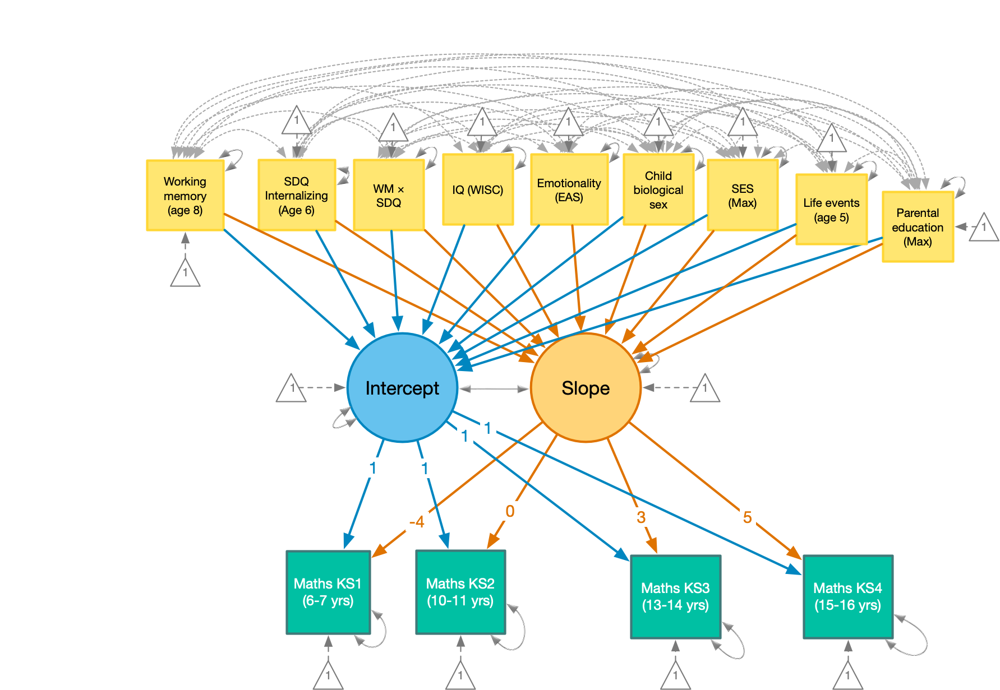

```{r setup, include=FALSE}
options(htmltools.dir.version = FALSE)
knitr::opts_chunk$set(echo = FALSE, warning = FALSE, message = FALSE)

source("andy_themes.R")

library(Amelia)
library(blavaan)
library(here)
library(kableExtra)
library(lavaan)
library(mice)
library(semTools)
library(sjstats)
library(summarytools)
library(tidyverse)
library(viridis)

teds <- here("data/teds_mini.csv") %>% read_csv() %>% 
  mutate(
    sex1 = sex1 %>% forcats::as_factor() %>% fct_relevel("Female")
  )

maths_wide <- here("/data/wm_anx_data.csv") %>% 
  read_csv() %>%
  mutate(
    sex = sex %>% forcats::as_factor(),
    par_ed_fct = par_ed_fct %>% forcats::as_factor(),
    cidB3045 = cidB3045 %>% factor()
    )

maths_tidy <- here("/data/wm_tidy.csv") %>%
  read_csv() %>%
  mutate(
    sex = sex %>% forcats::as_factor(),
    par_ed_fct = par_ed_fct %>% forcats::as_factor(),
    cidB3045 = cidB3045 %>% factor()
    )


fiction_tib <- here("/data/stats_teaching.csv") %>%
  read_csv() %>% 
  filter(include == 1) %>% # elimites excluded participants
  rename(sci_fi = 'sci fi') %>% 
  mutate(
    condition = condition %>% factor(., levels = 1:3, labels = c("Narrative", "Socratic", "Textbook")),
    sex = sex %>% factor(., levels = 1:2, labels = c("Male", "Female"))
  )
  
```


## Collaborators

--

ALSPAC

- Danielle Evans (University of Sussex)

--

TEDS

- Yulia Kovas (Goldsmiths, University of London)
- Tomasz Bloniewski (Goldsmiths, University of London)
- Danielle Evans (University of Sussex)


.footnote[
Slides created via the R package [xaringan](https://github.com/yihui/xaringan).

The chakra comes from [remark.js](https://remarkjs.com), [knitr](http://yihui.name/knitr), and [R Markdown](https://rmarkdown.rstudio.com).
]


???

Very new topic for me:
* analysing data literally last week
* haven't pulled it together in any coherant way
* If you're expecting a sleek/coherant presenation you have come to the wrong place.

---

## Why maths?

--

The UK is one of the highest spenders on education<sup>1</sup>, with over $110,000 spent on every student throughout their schooling

--

Despite this spending, maths performance of UK students is average compared to other nations<sup>2</sup>

--

~49% of working-age adults have the maths skills expected of primary-school children

Only ~22% of working-age adults have the equivalent to GCSE math grade C or above

--


.footnote[
[1] [www.nfer.ac.uk/news-events/nfer-blogs/international-school-spending-how-does-the-uk-compare/](https://www.nfer.ac.uk/news-events/nfer-blogs/international-school-spending-how-does-the-uk-compare/)

[2] [assets.publishing.service.gov.uk/government/uploads/system/uploads/attachment_data/file/574925/PISA-2015_England_Report.pdf](https://assets.publishing.service.gov.uk/government/uploads/system/uploads/attachment_data/file/574925/PISA-2015_England_Report.pdf)
]

???

The UK is one of the highest spenders on education, with over $110,000 spent on every student throughout their schooling. This means the UK is in the top six for education expenditure. Despite this extra funding per child, the maths performance of students in the UK is average compared to other nations (PISA REFS) and is far below other countries that spend much less per child (Europe, Asia etc., OECD/NFER from above). The problems stemming from poor maths achievement in school leads well into adult life. It is estimated that 49% of working-age adults have the maths skills expected of primary-school children, with only around 22% of working-age adults, having the equivalent of a C-grade or above in GCSE maths (ADD REF: https://www.nationalnumeracy.org.uk/sites/default/files/nn124_essentials_numeracyreport_for_web.pdf). Although these statistics are now quite dated, more recent data from the 2015 PISA suggests that numeracy levels of the UK have not changed since 2012 (REFS). These statistics highlight the increasing importance of investigating maths abilities of children and adolescents in the UK. The earlier such problems can be identified, the earlier the children most at-risk of poor performance can receive evidence-based interventions to improve their abilities. One way to examine this is to look at the predictors of maths skills in early childhood and investigate the effects on maths performance over time. 

---


## School transition

--

```{r, out.width = "600px"}

```

???

One explanation of poor adult competency in maths could be difficulties across the transition from primary to secondary education.

This transition is (potentially) one of the most stressful events in a young person's life. It, therefore, makes sense that this could be where it goes wrong for many people. 

In this talk I describe two studies:
* one that looks at predictors of a successful transition
* One that looks at the future impact of the trajectory across transition. 

---
class: center

--




???

Turns out that the literature on transition across primary-secondary education is very diffuse.

This diagram shows our best attempt to oragnise the literature.

We identified:

* Contextual variables
* Enironmental variables
* inter-individual components


---
## Attentional control theory
### Eysenck et al. (2007)

--

Anxiety impairs performance by consuming cognitive and attentional resources that would otherwise be used on cognitive tasks (e.g., maths)

--

Anxiety is associated longitudinally with poorer academic outcomes (e.g., maths)
- Reviewed in Evans et al., 2018

--

Working memory capacity (WMC) moderates anxiety effects on cognition (Owens et al., 2014)

- Cognitive performance will be lowest if WMC is low and trait anxiety is high
- Cognitive performance should improve if WMC and anxiety are both high

--

Does WMC moderate the effects of anxiety on trajectories of maths achievement across school transition?

???

The Attentional Control Theory (ACT; Eysenck, Derakshan, Santos, & Calvo, 2007),  provides an underlying mechanism of how internalising disorders (specifically anxiety) may influence the performance of maths skills. The ACT proposes that anxiety impairs performance by consuming cognitive and attentional resources that would otherwise be used on the mathematical task. Eysenck and colleagues argued that an anxious individual would preferentially attend to threat-related stimuli, over that of neutral stimuli. To illustrate, an anxious individual experiencing worrisome thoughts while being asked to perform a maths task is more likely to allocate attentional resources to their worried thoughts and less to the task itself, and consequently, perform poorly on the maths task. 

---

## Study 1: Predictors of mathematical trajectories across the transition

--

Avon Longitudinal Study of Parents and Children (ALSPAC)<sup>1</sup>
- 15,438 pregnancies
- Has been found to be broadly representative of children in the UK at that time.
- Children in Avon were as likely as other UK children to be living with a single parent (4% ALSPAC, 5% UK), to have parents with
a university degree (14% ALSPAC, 13.7% UK), and to have non-European, non-Caucasian parents (5.1% ALSPAC, 6.4% UK)


.footnote[
[1] [www.bristol.ac.uk/alspac/researchers/cohort-profile/](http://www.bristol.ac.uk/alspac/researchers/cohort-profile/)
]

???

We used the Avon Longitudinal Study of Parents and Children (ALSPAC) birth cohort (www.alspac. bris.ac.uk). Pregnant women living in the area of Avon (United Kingdom [UK]) with expected dates of delivery between April 1, 1991, and December 31, 1992, were recruited; thus the sample consisted of 14,541 pregnancies with 14,062 live births ,of which 13,988 individuals were alive at 1 year. The county of Avon comprised a mixture of rural areas, inner city, suburbs, and mid-sized towns, and the population has been found to be broadly representative of children in the UK at that time. In particular, children in Avon were as likely as other children in the UK to be living with a single parent (4% ALSPAC versus 5% rest of the UK at the time the study was initiated), their parents equally likely to have a university degree (14% versus 13.7%), and were as likely to have non-European, non-Caucasian parents (5.1% versus 6.4%). Ethical approval was obtained from the ALSPAC Law and Ethics Committee and the Local Research Ethics Committees. Informed consent was obtained from the parents of the children in the study.’  
(copied from: Stringaris, Maughan, & Goodman, 2010)


---
## Exclusions

```{r}

n_base <- maths_wide %>% nrow()

maths_wide <- maths_wide %>%
  mutate(
    sen = ifelse(is.na(sen1),
                 ifelse(is.na(sen2), NA, 
                        ifelse(sen2 == "Yes", "Yes", "No")),
                 ifelse(sen1 == "Yes", "Yes", "No")
                 )
  )

maths_wide <- maths_wide %>%
  dplyr::filter(eng_prof != "Other Main Lang" | is.na(eng_prof)) %>% 
  dplyr::select(-eng_prof)

n_after_eng_prof <- maths_wide %>% nrow()

maths_wide <- maths_wide %>%
  filter(sen == "No" | is.na(sen)) %>% 
  dplyr::select(-c(sen, sen1, sen2))

n_after_sen <- maths_wide %>% nrow()

maths_wide <- maths_wide %>% 
  mutate(
    maths_na = is.na(sat140) + is.na(ks2_mat) + is.na(ks3_mat) + is.na(ks4_maths)
  ) %>% 
  dplyr::filter(maths_na != 4) %>% 
  dplyr::select(-maths_na)

n_no_maths <- maths_wide %>% nrow()

maths_wide <- maths_wide %>% 
  dplyr::mutate(
    pred_na = is.na(par_ed_fct) + is.na(eas_emot) + is.na(ses_max) + is.na(life_evs_5) + is.na(int_sdq_6) + is.na(iq_wisc) + is.na(wm_8)
    ) %>% 
  dplyr::filter(pred_na < 5) %>% 
  dplyr::select(-pred_na)

n_half_preds <- maths_wide %>% nrow()

```


--

*N* before exclusions
- 15,438

--

*N* after exclusions
- Those alive at 1-year (*N* = 14,684)
- We took only the first born of any multiple births (*N* = `r n_base`)
- English not the first language (*N* = `r n_after_eng_prof`)
- Special educational needs at either 7-8 or 10-11 years (*N* = `r n_after_sen`)
- No key stage maths data (*N* = `r n_no_maths`)
- Missing data for > 50% of the model predictors (*N* = `r n_half_preds`)

---

## Contextual predictors

--

**Sex**: Biological sex (Male = 0, Female = 1)

**SES**: Socio-economic status measured using the Cambridge Social Interaction and Stratification Scale (CAMSIS).
- Scores can range from 1 (least advantaged) to 99 (most advantaged).
- The largest of the parent's CAMSIS scores at 32 weeks gestation was used.

**Parental education**: measured using the highest of the parent's qualifications at 32 weeks gestation
- No qualifications, no higher than CSE, vocational training, O-level or equivalent, A-level or equivalent, university degree
- Dummy coded (CSE as baseline)

**Life events age 5-7**: Traumatic Life Events score (0-72) at age 6.75 years.
- Parents/carers were asked about traumatic events that have happened since the child’s 5th birthday. 


???

* Sex: Male is baseline category
* SES (ses_max): The CAMSIS measures occupational structure based upon social interactions (Prandy & Lambert, 2003).
    + Has a mean of 50 and a standard deviation of 15 in the national population (Ralston, et al., 2016).
    + The correlation between mother and partner at different timepoints was high (.60-.89).
    + The data available for each timepoint decreased with each wave; to retain as much data as possible, the highest score at 32 weeks gestation was used.
* Parental education (par_ed_max):
    + Coded as: no qualifications, no higher than CSE, vocational training, O-level or equivalent, A-level or equivalent, university degree
    + The highest qualification available was taken from either parent.
    + There was no-one in the 'no qualification' category.

* Traumatic Life Events (life_evs_5):
    + This score was a weighted sum of items. Examples:
        - child was taken into care,
        - a pet died,
        - child moved home,
        - child was physically hurt by someone,
        - child was sexually abused,
        - somebody in the family died
    + Outcome: ‘yes the event happened, and the child was **very upset**, **quite upset**, **a little upset**, **not upset**, **the event did not happen**.
    + A high score corresponds to a higher number of events/the child was more affected

---
## Within-individual predictors

--

**Emotionality**
- The Emotionality Activity Sociability (EAS) temperament measurement scale (Buss & Plomin, 1986) at 38 months (3.17 years). (Range: 5 to 25 with a high score corresponding to higher emotionality).

**Internalizing**:
- Internalizing (proxy for anxiety) measured using the The Strengths and Difficulties Questionnaire (SDQ) at age 6.75.
- The sum of *emotional symptoms* and *peer problems subscales* were used.

**Working memory**
- The Wechsler Intelligence Scale for Children (WISC-III; Wechsler, 1992) at age 8 (forwards and backwards digit span).

**IQ**
- IQ at age 8 measured using the WISC-III.


???

* EAS Scale – Emotionality (eas_emot)
     + Items include: *Child cries easily*, *child tends to be somewhat emotional*,
     + Rating: not at all like, not much like, somewhat like, quite like, and exactly like.
* Internalising Symptoms – measured by The Strengths and Difficulties Questionnaire (SDQ).
    + Assesses general mental health functioning: **prosocial behaviour**, **hyperactivity**, **emotional symptoms**, **conduct problems**, and **peer problems**.
    + Internalising = sum of emotional symptoms and peer problems (0-20 total).
    + Emotional problems: *I worry a lot*, *I am often unhappy*, *I have many fears*. 
    + Peer problems: *I am usually on my own*, *I have one good friend or more*, *other children or young people pick on me*. 
* Working memory and IQ (wm_8, iq_wisc): The Wechsler Intelligence Scale for Children (WISC-III; Wechsler, 1992) was administered as part of the clinic in focus session at age 8. Only a sample of the cohort were invited to this session.

---
class: center
--


???

Latent growth model
* Intercept = maths at KS2
* Rate of change of maths attainment
* looking at predictors of slope mainly.
* Also checked results using a multilevel growth model.

---

```{r}
maths_wide <- maths_wide %>%
  mutate(
    ses_cent = ses_max - mean(ses_max, na.rm = TRUE),
    iq_cent = iq_wisc - mean(iq_wisc, na.rm = TRUE),
    wm_cent = wm_8 - mean(wm_8, na.rm = TRUE),
    emot_cent = eas_emot - mean(eas_emot, na.rm = TRUE)
  )
```


## Statistical considerations

--

**Centring**: To ease interpretation, predictors for which 0 is not a meaningful value were centred
- SES
- IQ
- Working memory
- Emotionality

--

**Missing data**
- Patterns of missing data in predictors
- Models fit with lavaan<sup>1</sup> using multiple imputation based on 70 imputed data sets imputing predictors only<sup>2</sup>
- FIML estimator

.footnote[
[1] Rosseel, Y. (2012). Lavaan: an R package for structural equation modeling. Journal of Statistical Software, 48, 1–36.

[2] Using the **semTools** (Jorgensen, Pornprasertmanit, Schoemann, & Rosseel, 2018)  and **Amelia** (Honaker,King, & Blackwell, 2011) packages
]


---
class: middle, center

```{r}
maths_wide %>%
  dplyr::select(sat140:ks4_maths, ses_cent, iq_cent, wm_cent, emot_cent, int_sdq_6, life_evs_5) %>%
  rename(
    SES = ses_cent,
    IQ = iq_cent,
    `Working memory` = wm_cent,
    Emotionality = emot_cent,
    Internalizing = int_sdq_6,
   `Maths (KS 1)` = sat140,
  `Maths (KS 2)` = ks2_mat,
   `Maths (KS 3)` = ks3_mat,
  `Maths (KS 4)` = ks4_maths,
  `Life events` = life_evs_5
  ) %>%
  tidyr::gather(key = "Variable", factor_key = TRUE) %>% 
  ggplot(aes(value)) +
  geom_histogram(colour = cbBlueDark, fill = cbBlue, alpha = 0.7) + 
  facet_wrap(~ Variable, scales = "free")
```

---
class: center, middle

## Predictors of the intercept

```{r}

lavaan_tib <- maths_wide %>% 
  mutate(
    cse_voc = ifelse(is.na(par_ed_fct), NA, ifelse(par_ed_fct == "Vocational", 1, 0)),
    cse_olevel = ifelse(is.na(par_ed_fct), NA, ifelse(par_ed_fct == "O level", 1, 0)),
    cse_alevel = ifelse(is.na(par_ed_fct), NA, ifelse(par_ed_fct == "A level", 1, 0)),
    cse_degree = ifelse(is.na(par_ed_fct), NA, ifelse(par_ed_fct == "Degree", 1, 0))
  ) %>% 
  select(-c(par_ed_fct, cidB3045, ses_max, wm_8, iq_wisc, eas_emot))

#define model
wmanx_model <- 'i =~ 1*sat140 + 1*ks2_mat + 1*ks3_mat + 1*ks4_maths
s =~ -4*sat140 + 0*ks2_mat + 3*ks3_mat + 5*ks4_maths

#regressions
i ~ wm_cent + int_sdq_6 + iq_cent + emot_cent + ses_cent + cse_voc + cse_olevel + cse_alevel + cse_degree + sex + life_evs_5 + wm_cent:int_sdq_6
s ~ wm_cent + int_sdq_6 + iq_cent + emot_cent + ses_cent + cse_voc + cse_olevel + cse_alevel + cse_degree + sex + life_evs_5 + wm_cent:int_sdq_6
'
```

```{r, eval=FALSE}
#fit model

am_imps <- amelia(lavaan_tib, m = 70, p2s = 0, frontend = FALSE, noms = c("sex", "cse_voc", "cse_olevel", "cse_alevel", "cse_degree"), idvars = c("sat140", "ks2_mat", "ks3_mat", "ks4_maths"))

wmanx_mi <- growth.mi(wmanx_model, data = am_imps$imputations, missing = "fiml")

mod_params <- wmanx_mi %>%
  summary(., ci = TRUE, add.attributes = FALSE, standardized = "std.all") %>%
  rename(
    Effect = rhs,
    Estimate = est,
    SE = se,
    p = pvalue,
    lower = ci.lower,
    upper = ci.upper,
    `Std. estimate` = std.all
  )

#library(semPlot)
#growth(wmanx_model, data = lavaan_tib, missing = "fiml") %>% semPlot::semPaths(.)

#here("/data/alspac_mi_growth_params.csv") %>% write_csv(mod_params, .)
```

```{r}

mod_params <- here("/data/alspac_mi_growth_params.csv") %>%
  read_csv()

predictor_labs <-c("Working memory", "Internalizing (SDQ)", "IQ", "Emotionality", "SES", "Edu: CSE vs. vocational", "Edu: CSE vs. O Level", "Edu: CSE vs. A Level", "Edu: CSE vs. Degree", "Sex", "Life events age 5-7", "Working memory × SDQ")

i_params <- mod_params %>% 
  dplyr::filter(lhs == "i", op == "~") %>% 
  dplyr::select(Effect, Estimate, SE, lower, upper, `Std. estimate`, p) %>% 
  mutate(
    Effect = predictor_labs
  )

i_sig_rows <- i_params %>%
  mutate(row = rownames(.) %>% as.numeric()) %>% 
  filter(p < 0.05) %>%
  dplyr::pull(row)

s_params <- mod_params %>% 
  dplyr::filter(lhs == "s", op == "~") %>% 
  dplyr::select(Effect, Estimate, SE, lower, upper, `Std. estimate`, p) %>% 
  mutate(
    Effect = predictor_labs
  )

s_sig_rows <- s_params %>%
  mutate(row = rownames(.) %>% as.numeric()) %>% 
  filter(p < 0.05) %>%
  dplyr::pull(row)

```

```{r, results = 'asis'}
i_params %>% 
  knitr::kable(caption = "Table 1: Model parameters for predictors of the intercept of maths achievement", digits = 3) %>%
  kableExtra::kable_styling(bootstrap_options = c("striped", "condensed"), font_size = 16) %>% 
  row_spec(0, align = "c") %>%
  add_header_above(c(" " = 3, "95% CI" = 2, " " = 2))
```


???
Outcome has a range of 0-6 at this age.

Significant predictors of intercept (maths at KS2, age 11)

* Working memory = higher attainment (1 extra item on digit span (range 0-25) = 0.019 increase in maths)
* SDQ = lower attainment (tiny effect, 1 unit (range 0-20) = -0.015 decrease in maths
* IQ = higher attainment (shift of 10 units = 0.20 increase in maths)
* SES = higher attainment (10 unit shift in SES, range 20-100, sees a 0.05 increase in maths)
* Parent education: O level vs CSE = 0.19 increase in maths (tiny effect), A-level vs CSE (0.26 increase in maths), degree vs CSE (0.45 increases in maths)
* Sex: girls attainment is 0.049 lower than boys (tiny effect)
* SDQ moderation of the effect of working memory on attainment is a teeny weeny effect


---
class: center, middle

## Predictors of the slope

```{r, results = 'asis'}

s_params %>% 
  knitr::kable(caption = "Table 2: Model parameters for predictors of the slope of maths achievement", digits = 3) %>%
  kableExtra::kable_styling(bootstrap_options = c("striped", "condensed"), font_size = 16) %>% 
  row_spec(0, align = "c") %>%
  add_header_above(c(" " = 3, "95% CI" = 2, " " = 2))

```

???
Group level ROC is about 0.5 (so 0.5 increase per year).

Substantive predictors of slope (ROC)
* Working memory = 1 extra item on digit span (range 0-25) = 0.001 increase in ROC (*ns*)
* SDQ = 1 point on SDQ (0-20) = 0.001 decrease in ROC (*ns*)
* IQ = 10 unit shift in IQ = 0.03 increase in ROC
* SES = 10 unit shift in SES (range 20-100) = 0.01 increase in ROC
* Parent education: successive shifts from CSE lead to increases in ROC of 0.002 to 0.095
* SDQ moderation of the effect of working memory on attainment is a zero effect


---
class: center, middle

## Bayesian estimates (intercept)

```{r}
bayes_out <- here("/data/alspac_bayes.out.csv") %>%
  read_csv() %>% 
  slice(9:32)

i_b_params <- bayes_out %>% 
  slice(1:12) %>%
  mutate(
    Effect = predictor_labs
  ) %>% 
  left_join(., i_params %>% dplyr::select(Effect, Estimate), by = "Effect") %>% 
  rename(
    Bayesian = Estimate.x,
    ML = Estimate.y
  ) %>% 
  dplyr::select(Effect, ML, Bayesian, Lower, Upper, Prior)

s_b_params <- bayes_out %>% 
  slice(13:24) %>%
  mutate(
    Effect = predictor_labs
  ) %>% 
  left_join(., s_params %>% dplyr::select(Effect, Estimate), by = "Effect") %>% 
  rename(
    Bayesian = Estimate.x,
    ML = Estimate.y
  ) %>% 
  dplyr::select(Effect, ML, Bayesian, Lower, Upper, Prior)
```

```{r, results = 'asis'}
i_b_params %>% 
  knitr::kable(caption = "Table 3: Bayesian estimates for predictors of the intercept of maths achievement", digits = 3) %>%
  kableExtra::kable_styling(bootstrap_options = c("striped", "condensed"), font_size = 16) %>% 
  row_spec(0, align = "c") %>%
  row_spec(i_sig_rows, background = "#ff9980") %>% 
  add_header_above(c(" " = 1, "Estimation" = 2, "95% HPD" = 2, " " = 1))
```


???
Outcome has a range of 0-6 at this age.

Significant predictors of intercept (maths at KS2, age 11)

* Working memory = higher attainment (1 extra item on digit span (range 0-25) = 0.019 increase in maths)
* SDQ = lower attainment (tiny effect, 1 unit (range 0-20) = -0.015 decrease in maths
* IQ = higher attainment (shift of 10 units = 0.20 increase in maths)
* SES = higher attainment (10 unit shift in SES, range 20-100, sees a 0.05 increase in maths)
* Parent education: O level vs CSE = 0.19 increase in maths (tiny effect), A-level vs CSE (0.26 increase in maths), degree vs CSE (0.45 increases in maths)
* Sex: boys attainment is 0.049 lower than girls (tiny effect)
* SDQ moderation of the effect of working memory on attainment is a teeny weeny effect


---
class: center, middle

## Bayesian estimates (slope)

```{r, results = 'asis'}
s_b_params %>% 
  knitr::kable(caption = "Table 4: Bayesian estimates for predictors of the slope of maths achievement", digits = 3) %>%
  kableExtra::kable_styling(bootstrap_options = c("striped", "condensed"), font_size = 16) %>% 
  row_spec(0, align = "c") %>%
  row_spec(s_sig_rows, background = "#ff9980") %>% 
  add_header_above(c(" " = 1, "Estimation" = 2, "95% HPD" = 2, " " = 1))
```


???
Group level ROC is about 0.5 (so 0.5 increase per year).

Substantive predictors of slope (ROC)
* Working memory = 1 extra item on digit span (range 0-25) = 0.001 increase in ROC (*ns*)
* SDQ = 1 point on SDQ (0-20) = 0.001 decrease in ROC (*ns*)
* IQ = 10 unit shift in IQ = 0.03 increase in ROC
* SES = 10 unit shift in SES (range 20-100) = 0.01 increase in ROC
* Parent education: successive shifts from CSE lead to increases in ROC of 0.002 to 0.095
* SDQ moderation of the effect of working memory on attainment is a zero effect

---
class: inverse

## Summary

--

Significant predictors of intercept (maths at KS2)
- Working memory = higher attainment (tiny effect)
- SDQ = lower attainment (tiny effect)
- IQ = higher attainment (small effect)
- Parent education: strongest effects of the bunch
- Sex: girls attainment is lower than boys (tiny effect)

--

Significant predictors of the rate of change (RoC)
- IQ = increased RoC (small effect)
- SES = increased RoC (small effect)
- Parent education: higher education = increased RoC (reasonable effect size)

--

Substantive predictor
- SDQ had a 'teeny weeny' effect in moderating the effect of working memory on attainment at KS2 
- SDQ had a basically zero effect in moderating the effect of working memory on the RoC of maths achievement

---

## Study 2: predictors of maths anxiety

--

*Feelings of stress, fear and tension when engaging in math* (Beilock et al., 2015)

- Characterized by the same avoidance, physiological arousal and subjective feelings of fear as diagnostic criteria for anxiety disorders (Maloney, 2016)

--

Math anxiety

- Hinders achievement in mathematics (Ashcraft, 2002)
- Is a barrier to learning statistics (Field, 2014)
- Is associated with lower earning potential, impaired financial planning, poor self-efficacy in teachers, and poorer drug calculations in nurses (Maloney, 2016)

--

Theories of maths anxiety (Carey et al., 2016)

- Maths anxiety leads to worse mathematical achievement
- Poor mathematical achievement leads to maths anxiety
- The relationship is reciprocal

---

## TEDS study

Aims

- The primary- to secondary transition potentially affects the trajectories of emotional health and academic achievement (Evans, Borriello & Field, 2018)
- Does the trajectory of mathematical attainment across this transition predict later maths anxiety?

--

A secondary analysis of data from the Twin Early Development Study (TEDS)

- Longitudinal study of over 16,000 twin pairs born between 1994 and 1996 (Haworth, Davis & Plomin, 2013)

---
## TEDS study

### Phase 1

- A multilevel growth model predicting mathematical achievement from time (age from 9 years: 0, 1, 3 years)
- The intercept and slope for each child were used as predictors in phase 2
    
$$\begin{align}
\text{Maths achievement}_{ij} &= \pi_{0i} + \pi_{1i}\text{Time}_{ij} + \epsilon_{ij} \\
\pi_{0i} &= \gamma_{00} + \zeta_{0i} \\
\pi_{1i} &= \gamma_{10} + \zeta_{1i} \\
\end{align}$$

---
## TEDS study

### Phase 2

A linear model predicting maths anxiety from
- Sex
- Socio-economic status (centered)
- Emotional health (SDQ at ages 9 and 12)
- Average verbal cognitive ability (centered) at 10-12 years
- The intercept and slope of maths achievement from 9 to 12 years
- The interactions between each predictor and the slope of maths achievement

Due to heteroscedastic residuals, HC4 robust standard errors were used<sup>1</sup>

.footnote[
[1] Using the **sjstats** package (Lüdecke, 2017) in R 3.5.1 (R core team, 2018)
]

???

* TEDS: Longitudinal study of over 16,000 twin pairs born in England and Wales between 1994 and 1996 that are representative of the UK population (Haworth, Davis & Plomin, 2013).
* The statistical models were fit on the 753 participants (one from each twin pair) for which there was data on mathematical performance across the primary- to secondary-education transition (i.e., at ages 9, 10 and 12 years) and maths anxiety at age 18.
* Phase 1: 
    + A multilevel growth model predicting mathematical achievement from time (age from 9 years: 0, 1, 3 years) with random slopes and intercepts.
    + The intercept and slope for each child were extracted to be used as predictors in the model of maths anxiety.
* A linear model was fit predicting maths anxiety from child sex, socio-economic status, emotional health (SDQ at ages 9 and 12), average verbal cognitive ability at 10-12 years, the intercept and slope of maths achievement from 9 to 12 years, and the interactions between each predictor and the slope of maths achievement.
* Due to heteroscedastic residuals, HC4 robust standard errors were computed using the the **robust()** function from the **sjstats** package (Lüdecke, 2017) in R 3.5.1 (R core team, 2018).

---
## Exclusions

```{r}
teds_ma <- teds %>% 
  dplyr::filter(!is.na(maths_anx_18)) %>% 
  dplyr::select(id_fam, sex1, ases, sdq_09, sdq_12, verbal_mean, maths_int, maths_slope, anx_spaa_18, maths_anx_18)

total_traj <- teds_ma %>% 
  dplyr::filter(!is.na(maths_int) & !is.na(maths_slope))

total_n <- teds %>%  nrow()
total_ma_n <- teds_ma %>% nrow()
total_traj_n <- total_traj %>% nrow()

```


--

*N* before exclusions
- `r total_n`

--

*N* after exclusions
- No maths anxiety data (*N* = `r total_ma_n`)
- No maths trajectory data (*N* = `r total_traj_n`)

---
class: middle, center

## Missing data

```{r}
total_traj %>% 
  dplyr::select(-c(id_fam, anx_spaa_18, maths_anx_18)) %>% 
  md.pattern(., plot = FALSE) %>%
  as_tibble(., rownames = "n") %>%
  dplyr::rename_all(~sub("V\\d", 'n_var_miss', .)) %>%
  mutate(
    n = n %>%  as.numeric()
  ) %>% 
  filter(is.na(n) == FALSE) %>%
  arrange(n_var_miss) %>% 
  dplyr::select(sex1, maths_int, maths_slope, ases, sdq_09, sdq_12, verbal_mean,  n) %>% 
  knitr::kable(.) %>% 
  kableExtra::kable_styling(bootstrap_options = "striped", font_size = 16)
```

---
class: middle, center

```{r}
teds %>%
  dplyr::select(maths_anx_18, ases, sdq_09, sdq_12, verbal_mean, maths_int, maths_slope) %>%
  rename(
    `Maths anxiety` = maths_anx_18,
    SES = ases,
    `SDQ (age 9)` = sdq_09,
    `SDQ (age 12)` = sdq_12,
    `Mean verbal attainment` = verbal_mean,
    `Maths intercept` = maths_int,
    `Maths slope` = maths_slope
  ) %>%
  tidyr::gather(key = "Variable", factor_key = TRUE) %>% 
  ggplot(aes(value)) +
  geom_histogram(colour = cbBlueDark, fill = cbBlue, alpha = 0.7) + 
  facet_wrap(~ Variable, nrow = 2, scales = "free")
```

???

* SES and Verbal are centred
* Group level slope in maths attainment is similar to alspac (0.5).

---

## Predictors of maths anxiety

```{r maths-anx-predict, echo = FALSE, results = 'asis'}

maths_anx_int <- lm(maths_anx_18 ~ sex1 + ases + sdq_09 + sdq_12 + verbal_mean + maths_int + maths_slope + maths_slope:sex1 + maths_slope:ases + maths_slope:sdq_09 + maths_slope:sdq_12 + verbal_mean:maths_slope, data = teds)

row_labs_2 <- c("Intercept", "Sex", "SES", "SDQ (age 9)", "SDQ (age 12)", "Verbal", "Maths (intercept)", "Maths (slope)", "Sex × Maths (slope)", "SES × Maths (slope)", "SDQ (age 9) × Maths (slope)", "SDQ (age 12) × Maths (slope)", "Verbal × Maths (slope)")


math_anx_tab <- maths_anx_int %>% 
  robust(., vcov.type = "HC4", conf.int = TRUE) %>%
  dplyr::select(-term) %>% 
  round(., 3) %>%
  mutate(
    Predictor = row_labs_2
  ) %>%
  rename(
    Estimate = estimate,
    lower = conf.low,
    upper = conf.high,
    SE = std.error,
    t = statistic,
    p = p.value
  ) %>% 
  select(Predictor, Estimate:p)

teds_sig_rows <- math_anx_tab %>%
  mutate(row = rownames(.) %>% as.numeric()) %>% 
  filter(p < 0.05) %>%
  dplyr::pull(row)

math_anx_tab %>% 
  knitr::kable(caption = "Table 5: Model parameters for predictors of maths anxiety age 17") %>% 
  kableExtra::kable_styling(bootstrap_options = c("striped", "condensed"), font_size = 16) %>% 
  row_spec(0, align = "c") %>%
  row_spec(teds_sig_rows, background = "#ff9980") %>% 
  add_header_above(c(" " = 3, "95% CI" = 2, " " = 2))

```

???

Significant predictors of maths anxiety (on 5 poinmt scale)
- Sex: boys are less maths anxious than girls (1.5 points lower on a 5 point scale)
- SDQ age 9 = unit shift (on 10 point scale) 0.28 shift in maths anxiety
- Maths ability pre-transition: 1 point hiogher (on 3 point scale) = 1.11 lower maths anxiety (on 5 point scale)
- The effect of SDQ at age 9 on maths anxiety was moderated by the trajectory of maths attainment 9see next slide)
- The relationship between high SDQ and maths anxiety gets weaker as the trajectory in maths attainment increases

---

Figure 4: Predicted values of maths anxiety from emotional health (SDQ) and the trajectory of mathematical achievement (9 to 12 years)

```{r surface-plot, warning = FALSE, echo = FALSE}

surf.colors <- function(x, col = terrain.colors(20)) {

  # First we drop the 'borders' and average the facet corners
  # we need (nx - 1)(ny - 1) facet colours!
  x.avg <- (x[-1, -1] + x[-1, -(ncol(x) - 1)] +
             x[-(nrow(x) -1), -1] + x[-(nrow(x) -1), -(ncol(x) - 1)]) / 4

  # Now we construct the actual colours matrix
  colors = col[cut(x.avg, breaks = length(col), include.lowest = T)]

  return(colors)
}

#min(maths_complete$sdq_09, na.rm = TRUE); min(maths_complete$maths_slope, na.rm = TRUE)
#max(maths_complete$sdq_09, na.rm = TRUE); max(maths_complete$maths_slope, na.rm = TRUE)

predictor_values <- data.frame()
row <- 1
for(i in seq(0, 10, 1)){
	for(j in seq(-0.2, 1.4, 0.2)){
		predictor_values[row, 1]<-j
		predictor_values[row, 2]<-i
		row = row + 1
	}
}
names(predictor_values) <- c("sdq_09", "maths_slope")

predictor_values <- predictor_values %>% 
  mutate(
    sex1 = "Male",
    ases = mean(teds$ases, na.rm = TRUE), 
    sdq_12 = mean(teds$sdq_12, na.rm = TRUE),
    verbal_mean = mean(teds$verbal_mean, na.rm = TRUE),
    maths_int = mean(teds$maths_int, na.rm = TRUE)
  )

fitted_values <- predict(maths_anx_int, predictor_values) %>% matrix(., 9, 11)

persp(seq(-0.2, 1.4, 0.2), seq(0, 10, 1), fitted_values, phi = 10, theta = 50,
  xlab = "Maths (slope 9-12)", ylab = "SDQ (age 9)", zlab = "Predicted maths anxiety", zlim = c(0, 25),
 col = surf.colors(fitted_values, col = viridis(40, alpha = 0.8)), border = par(fg = "grey35")
)
```

???

* SDQ positively related to predicted maths anxiety (high SDQ = high maths anxiety)
* Low SDQ
    + No relationship between maths trajectory and maths anxiety
    + Predicted maths anxiety is low regardless of trajectory
* High SDQ
    + Negative relationship between maths trajectory and maths anxiety
    + Steeper slope (BETTER TRAJECTRORY) = lower maths anxiety

---

Figure 5: Predicted values of maths anxiety from emotional health (SDQ) and the trajectory of mathematical achievement (9 to 12 years)

```{r sdq-plot, warning = FALSE, echo = FALSE}
plot_data <- fitted_values %>%
  as_tibble() %>% 
  dplyr::select(V1, V11) %>%
  dplyr::rename(
    `Low SDQ` = V1,
    `High SDQ` = V11
  ) %>% 
  mutate(
    `Maths trajectory` = seq(-0.2, 1.4, 0.2)
  ) %>% 
  tidyr::gather(key = SDQ, value = `Maths anxiety`, -`Maths trajectory`) %>% 
  ggplot(., aes(`Maths trajectory`, `Maths anxiety`, colour = SDQ))

plot_data +
  geom_smooth(method = "lm", se = FALSE) + 
  theme_bw()
```

???

* SDQ positively related to predicted maths anxiety (high SDQ = high maths anxiety)
* Low SDQ
    + No relationship between maths trajectory and maths anxiety
    + Predicted maths anxiety is low regardless of trajectory
* High SDQ
    + Negative relationship between maths trajectory and maths anxiety
    + Steeper slope (BETTER TRAJECTRORY) = lower maths anxiety

---
class: inverse

## Summary

--

Significant predictors of maths anxiety
- Sex: boys are less maths anxious than girls (1.5 points lower on a 5 point scale)
- SDQ age 9 = higher maths anxious (small effect)
- Maths ability pre-transition: more ability = less anxiety (1.1 points lower on a 5 point scale)
- The effect of SDQ at age 9 on maths anxiety was moderated by the trajectory of maths attainment.
- The relationship between high SDQ and maths anxiety gets weaker as the trajectory in maths attainment increases

---
## General conclusions

- If you want your children to be good at maths, get a degree 😄
- Internalizing had a small impact on maths attainment at KS2, but not the trajectory over time.
- Maths anxiety is mostly affected by maths ability pre-transition
- The effects of SDQ were, at best, tiny
- We need to work on mathematical confidence *very* early on

---

class: inverse

# Join my cult

 @profandyfield

 www.discoveringstatistics.com

 www.miltonthecat.rocks

 www.youtube.com/profandyfield

---

## Reducing anxiety

--

- 38% of Psychology undergraduates struggle with statistics (Field, 2014)

--

- Maths anxiety is a barrier to learning maths and related subjects (Carey et al., 2016) but little is known about how to reduce it. 

--

- Children engage in story-based learning from a very early age, using metaphor to infer knowledge and description to create mental imagery (Egan & Gillian 2016).

--

- There is a dearth of tightly controlled experimental studies to demonstrate the efficacy of narrative-based teaching.

--

- Can embedding statistical teaching within a fictional narrative help to reduce anxiety and increase comprehension?

--

- This pilot study looked at the feasibility and plausible effects of using a fictional narrative to teach 11 statistical concepts.

---
## Methods

--

- Thirty-five (13 males, 22 females) participants aged 19-63 years (*M* = 31.35, *SD* = 13.86) were allocated randomly to statistical materials presented in: a standard textbook, Socratic dialogue or fictional narrative format.

--

- All materials were adapted from a textbook that uses a fictional narrative (Field 2016).

--

- Participants were pre-tested for their knowledge of 11 statistical concepts, their maths anxiety, and state anxiety.

--

- 22 multiple choice questions (2 per concept) were used to assess their understanding of the statistical concepts.

--

- We took Likert-scale measures of how complicated, engaging, enjoyable, funny, and relevant the teaching materials were as well as their ability to visualise them.

---
class: center, middle

## Engagement

```{r}
engage <- fiction_tib %>% 
  dplyr::select(id, condition, engaging, funny, complicated, relevant, enjoyable, visualise) %>% 
  gather(key = measure, value = rating, -c(id, condition)) %>% 
  mutate(
   measure = str_to_title(measure)
  )

engage_plot <- ggplot(engage, aes(condition, rating, colour = measure)) 
engage_plot +
  geom_point(size = 1, alpha = 0.7, position = position_jitterdodge(dodge.width = 0.5)) + 
  stat_summary(fun.data = "mean_cl_boot", position = position_dodge(width = 0.5)) +
  facet_wrap(~ measure) +
  scale_y_continuous(breaks= 0:5) + 
  coord_cartesian(ylim = c(0, 5)) +
  labs(x = "Reading material", y = "Rating (out of 5)") + 
  andy.dsus() +
  theme(legend.position = "none", text = element_text(size = 10), axis.text.x = element_text(angle = 45))
```

---
class: center, middle

## Statistical comprehension

```{r}

mcq_plot <- ggplot(fiction_tib, aes(condition, mcq, colour = condition))
mcq_plot + 
  geom_point(size = 1, alpha = 0.7, position = position_jitter(width = 0.1)) +
  stat_summary(fun.data = "mean_cl_boot") +
  scale_y_continuous(breaks = seq(0, 20, 2)) +
  coord_cartesian(ylim = c(0, 20)) +
  labs(x = "Reading material", y = "MCQ Score (out of 20)") +
  andy.dsus() +
  theme(legend.position = "none", text = element_text(size = 10))
```

---
class: middle, center

## Bayesian prior

```{r}

#create dummies

fiction_tib <- fiction_tib %>% 
  mutate(
    nar_vs_text = ifelse(condition == "Narrative", 1, 0),
    soc_vs_text = ifelse(condition == "Socratic", 1, 0)
  )

#visualise priors

prior_mean = 1
prior_sd = 2

ggplot(data.frame(x = c(-10, 10)), aes(x)) +
  stat_function(fun = dnorm, n = 1e3, args = list(mean = prior_mean, sd = prior_sd), color = cbRed, size = 1) +
  scale_x_continuous(breaks = -10:10) +
  geom_vline(xintercept = prior_mean, colour = cbOrange) +
  theme_bw()

```

---
## Bayesian estimates

--

- A Bayesian linear model predicting the multiple choice scores (0-22) from the reading conditions (dummy coded as narrative vs. textbook, Socratic vs textbook) was fit

--

- A broad Guassian prior was used representing a mean difference centred on 1, with plausible mean differences ranging between extremes of -5 to 7 (approx.)

--

- The 95% HPDI intervals indicated that the plausible effect of using fictional narratives compared to standard textbook presentation ranged from *b* = 0.28 to 4.85 (*M* = 2.43)

--

- In contrast, the plausible effect of using Socratic materials compared to standard textbook presentation ranged from *b* = -1.28 to 3.11 (*M* = 0.81)


---
class: inverse

# Join my cult

 @profandyfield

 www.discoveringstatistics.com

 www.miltonthecat.rocks

 www.youtube.com/profandyfield


```{r, eval=FALSE}
library(webshot)
here("bristol_2019.html") %>% webshot(., "bristol_2019.pdf")
```

